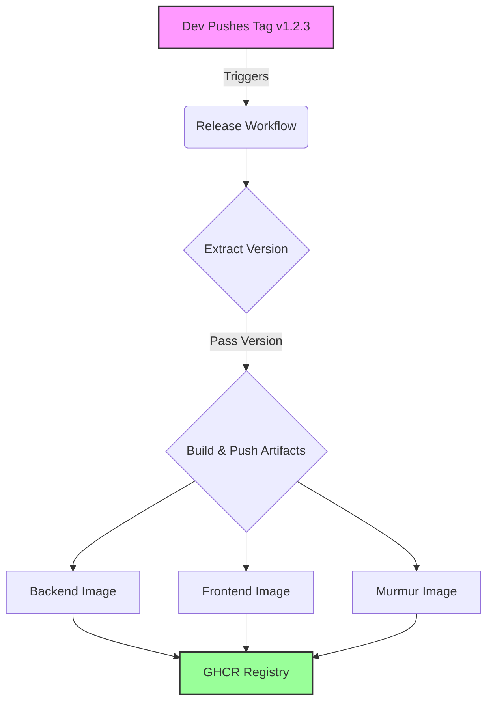
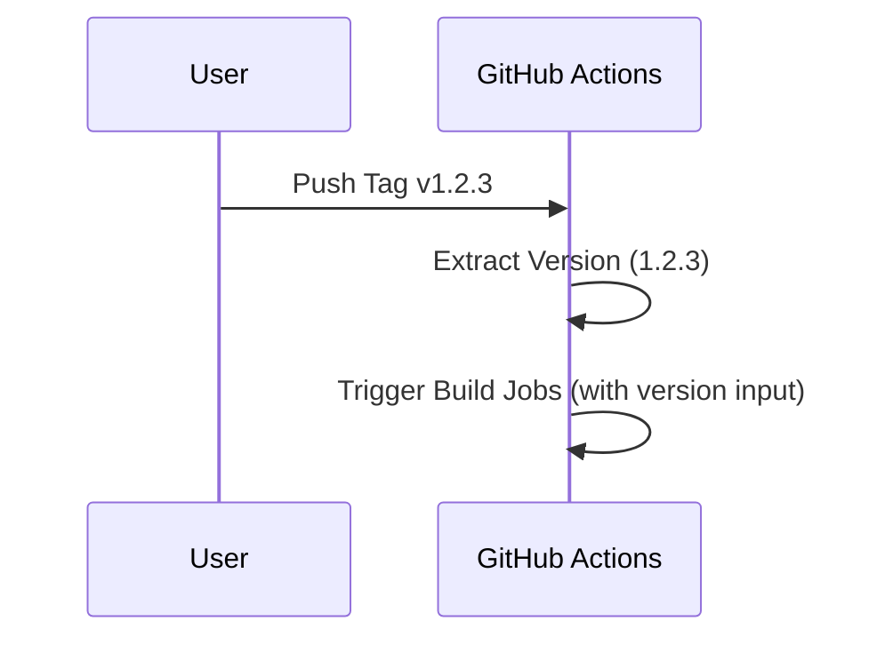
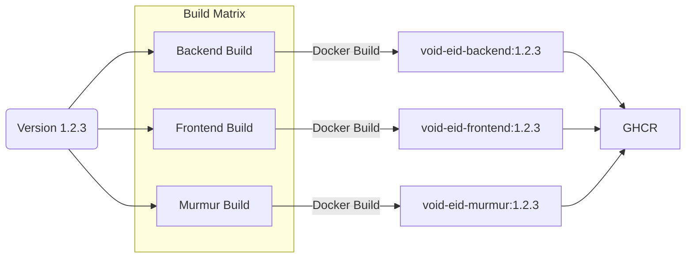

# Release Process

This document outlines the automated release process for Void eID. The process is triggered by git tags and handles version synchronization, artifact building, and publishing.

## Overview

The release workflow is designed to be fully automated. When a release tag (e.g., `v1.2.3`) is pushed to the repository, GitHub Actions orchestrates the entire process.



## Detailed Workflow

### 1. Version Extraction (`update-repo-version`)

The first job extracts the version version from the git tag (e.g., `v1.0.0` -> `1.0.0`) and makes it available to subsequent jobs.

> [!NOTE]
> This workflow does **not** commit the version change back to `main` due to branch protection rules. The source code on `main` remains at the development version. However, **all release artifacts (Binaries, Docker Images)** are patched during the build process to contain the correct version number.



### 2. CI Validation (`ci`)

The standard CI pipeline runs to ensure the release verify code quality and tests. It receives the version from the previous step to ensure it tests the correct code state.

### 3. Build and Publish (`build-and-push`)

This matrix job builds Docker images for all components. Crucially, it patches the files *again* in the build environment to ensure the built artifacts contain the correct version metadata, even if the git tag checkout points to the pre-bump commit.



## How to Release

To trigger a release:

1.  Ensure local `main` is up to date.
2.  Tag the commit:
    ```bash
    git tag v1.2.3
    git push origin v1.2.3
    ```
3.  Wait for the [GitHub Action](https://github.com/Scetrov/void-eid/actions) to complete.
4.  Pull the automated version bump commit:
    ```bash
    git pull origin main
    ```
